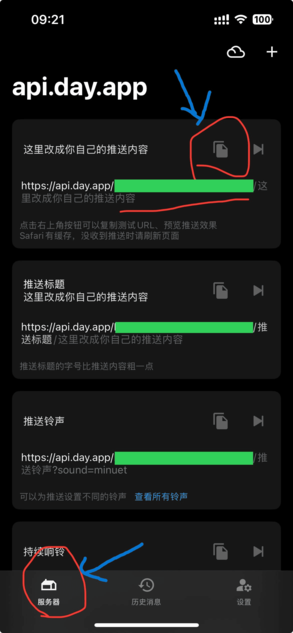

1. You need to download the Bark app to your phone
2. Open the Bark app and click the server button in the lower left corner
3. You can see the example, click the copy button to copy the URL
4. The URL is https://api.day.app/key/这里改成你自己的推送内容 this with your own push content, where KEY is the Bark KEY

