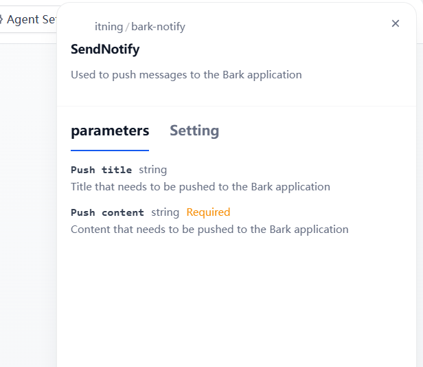

<h3 align="center">Bark Notify</h3>

---
# Bark Notify

Author: [@itning](https://github.com/itning)

The Bark Notify tool plugin can push your notifications to your device.

## Overview

## Usage

Install the plugin

After installation, you need to fill in the KEY and server address.

To be used as a tool.

