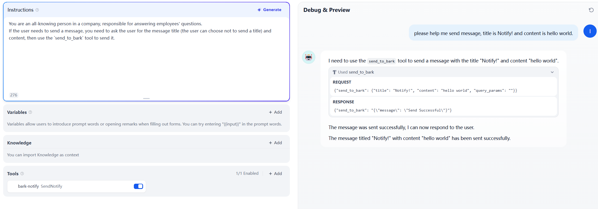

# Bark Notify

The Bark Notify tool plugin can push your notifications to your device.

Repository: https://github.com/itning/dify-bark-notify-plugin

## Overview

## Usage

Install the plugin

After installation, you need to fill in the KEY and server address.

To be used as a tool.

